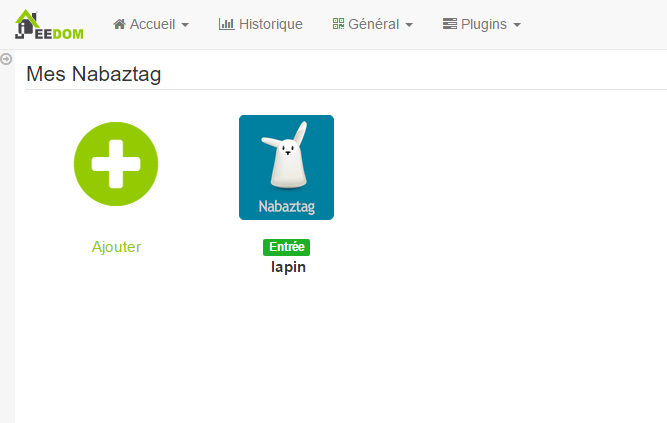
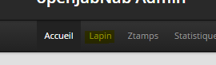

Plugin um den Nabaztag zu bestellen.

Konfiguration 
=============

Gerätekonfiguration 
=============================

Sobald das Plugin über den Markt installiert und aktiviert ist, greifen Sie auf das zu
Nabaztag Plugin Seite von :

Hier finden Sie alle Ihre Nabaztag-Geräte :

> **Tip**
>
> Platzieren Sie wie an vielen Stellen in Jeedom die Maus ganz links
> ruft ein Schnellzugriffsmenü auf (Sie können
> von deinem Profil immer sichtbar lassen).

Sobald ein Gerät ausgewählt ist, erhalten Sie :

Hier finden Sie die gesamte Konfiguration Ihrer Geräte :

-   **Name der Nabaztag-Ausrüstung** : Name Ihrer Nabaztag-Ausrüstung

-   **Übergeordnetes Objekt** : gibt das übergeordnete Objekt an, zu dem es gehört
    Ausrüstung

-   **Kategorie** : Gerätekategorien (es kann gehören
    mehrere Kategorien)

-   **Activer** : macht Ihre Ausrüstung aktiv

-   **Visible** : macht es auf dem Dashboard sichtbar

-   **Adresse (openjabnab.fr oder @IP)** : Openjabnab oder IP-Adresse (DNS)
    Ihr Openjabnab, wenn Sie es selbst hosten

-   **MAC-Adresse** : Mac-Adresse Ihres Kaninchens (siehe unten)

-   **API-Token Lila** : API-Token (siehe unten)

Nachfolgend finden Sie die Liste der Bestellungen :

-   Der im Dashboard angezeigte Name

-   Anzeige : ermöglicht die Anzeige der Daten im Dashboard

-   erweiterte Konfiguration (kleine gekerbte Räder) : Anzeigen
    die erweiterte Konfiguration des Befehls (Methode
    Geschichte, Widget…)

-   Test : Wird zum Testen des Befehls verwendet

Die Liste der Befehle lautet wie folgt :

-   **Debout** : Weckt das Kaninchen auf

-   **Redemarrer** : Starten Sie das Kaninchen neu

-   **Coucher** : Sagen wir dem Kaninchen, er soll ins Bett gehen

-   **Luftqualität** : Gibt Luftqualität (erfordert
    Aktivierung des entsprechenden Plugins in openjabnab)

-   **Ephemeride** : Geben Sie Ephemeride (erfordert Aktivierung von
    entsprechendes Plugin in openjabnab)

-   **Sprechende Uhr** : Gibt die Zeit an (erfordert die Aktivierung des
    entsprechendes Plugin in openjabnab)

-   **Wetter** : Gibt Wetter (erfordert Plugin-Aktivierung
    Korrespondent in openjabnab)

-   **Dicton** : Geben Sie ein Sprichwort (erfordert Plugin-Aktivierung
    Korrespondent in openjabnab)

-   **Linkes Ohr** : Hier können Sie die Position des Ohrs auswählen
    links (16 Positionen möglich)

-   **Rechtes Ohr** : Hier können Sie die Position des Ohrs auswählen
    rechts (16 Positionen möglich)

-   **Parle** : Sagen wir dem Kaninchen einen Satz

Maximale Adresse und Token abrufen 
===================================

Gehen Sie zur Website [openjabnab](http://openjabnab.fr/ojn_admin/index.php)
Melden Sie sich dann in Ihrem Konto an :

Klicken Sie auf Kaninchen :

Klicken Sie dann auf API :

Aktivieren Sie hier die lila und öffentliche API und erhalten Sie die Mac-Adresse sowie
den lila API-Schlüssel, um ihn in die Konfiguration Ihres Kaninchens zu integrieren
auf Jeedom

Widget 
======

Hier ist das Widget, das nach dem Erstellen der Ausrüstung erhalten wurde :

Changelog detailliert :
<https://github.com/jeedom/plugin-nabaztag/commits/stable>
