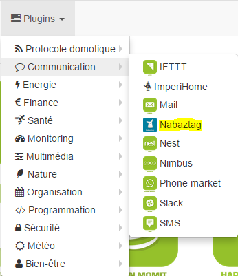
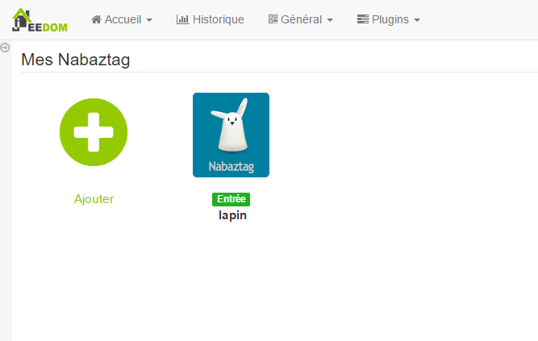
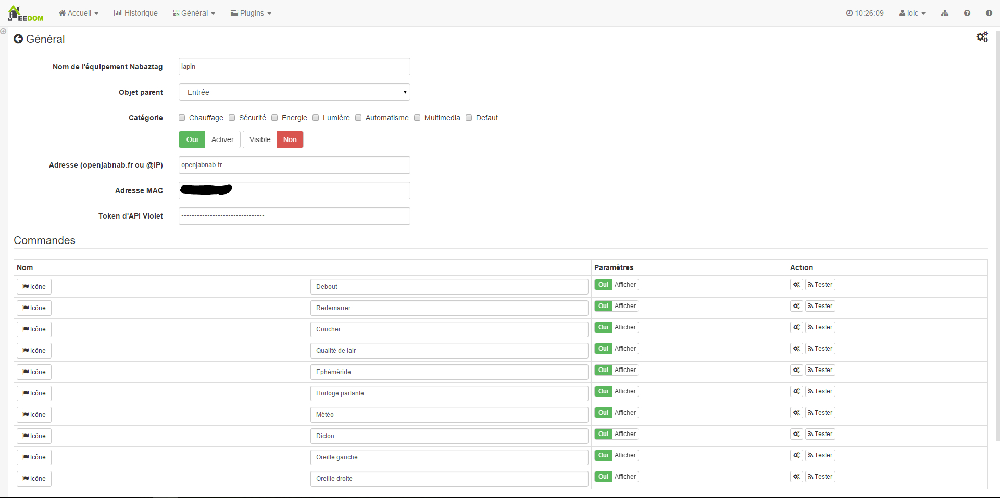
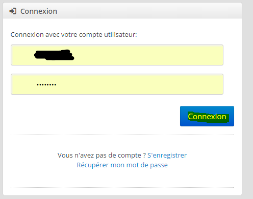
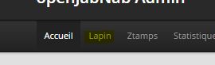
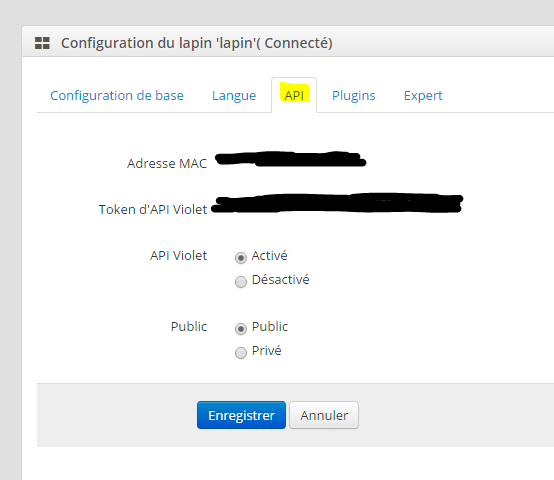
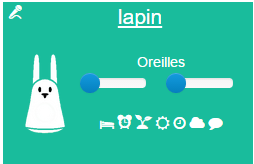

Plug-in para solicitar o Nabaztag.

Configuração 
=============

Configuração do equipamento 
=============================

Depois que o plug-in é instalado e ativado no Market, você acessa o
Página do plugin Nabaztag por :

Aqui você encontra todo o seu equipamento Nabaztag :

> **Dica**
>
> Como em muitos lugares em Jeedom, coloque o mouse na extremidade esquerda
> abre um menu de acesso rápido (você pode
> do seu perfil, deixe-o sempre visível).

Depois que um equipamento é selecionado, você obtém :

Aqui você encontra toda a configuração do seu equipamento :

-   **Nome do equipamento Nabaztag** : nome do seu equipamento Nabaztag

-   **Objeto pai** : indica o objeto pai ao qual pertence
    o equipamento

-   **Categoria** : categorias de equipamentos (pode pertencer a
    várias categorias)

-   **Ativar** : torna seu equipamento ativo

-   **Visivél** : torna visível no painel

-   **Endereço (openjabnab.fr ou @IP)** : openjabnab ou endereço IP (DNS)
    seu openjabnab se você o hospedar

-   **Mac Address** : o endereço mac do seu coelho (veja abaixo)

-   **Roxo do token da API** : Token de API (veja abaixo)

Abaixo você encontra a lista de pedidos :

-   o nome exibido no painel

-   Display : permite exibir os dados no painel

-   configuração avançada (pequenas rodas dentadas) : permite exibir
    a configuração avançada do comando (método
    história, widget ...)

-   Teste : permite testar o comando

A lista de comandos é a seguinte :

-   **Em pé** : Acorde o coelho

-   **Restart** : Reinicie o coelho

-   **Hora de dormir** : Vamos dizer ao coelho para ir para a cama

-   **Qualidade do ar** : Dá qualidade do ar (requer
    ativação do plugin correspondente em openjabnab)

-   **Efemérides** : Dar efemérides (requer a ativação de
    plugin correspondente no openjabnab)

-   **Relógio falante** : Dá o tempo (requer a ativação do
    plugin correspondente no openjabnab)

-   **Previsão do tempo** : Dá tempo (requer ativação de plug-in)
    correspondente em openjabnab)

-   **Dizendo** : Dê um ditado (requer ativação do plugin
    correspondente em openjabnab)

-   **Orelha esquerda** : Permite escolher a posição do ouvido
    esquerda (16 posições possíveis)

-   **Orelha direita** : Permite escolher a posição do ouvido
    direita (16 posições possíveis)

-   **Fala** : Vamos dizer uma frase para o coelho

Recuperar endereço máximo e token 
===================================

Ir para o site [openjabnab](http://openjabnab.fr/ojn_admin/index.php)
depois faça login na sua conta :

Clique no coelho :

Depois clique na API :

Ative aqui a API roxa e pública e obtenha o endereço mac, bem como
a chave API roxa para colocá-lo na configuração do seu coelho
no Jeedom

Widget 
======

Aqui está o widget obtido após a criação do equipamento :

Registro de alterações detalhado :
<https://github.com/jeedom/plugin-nabaztag/commits/stable>
